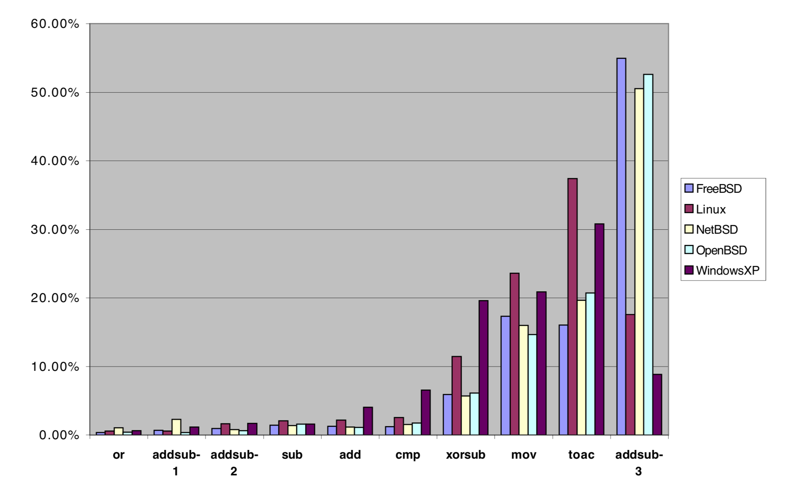

# 5. Further Discussion

情報隠蔽システムの強さは、そのデータの希少性 (特定サイズのcovertextに埋め込むことのできる情報の量)、ステルス性、および復元力の関数である[[9]](#bib-9)。

この章では、Hydanで現在実装されている特性とそれらを改善する方法について説明する。

## Data Rate

現在の埋め込み率は約 1/110 である。

等価な命令を利用して埋め込んでいるので、埋め込み率は実行可能ファイルの命令の分布に大きく依存する。
我々の分析によるとUNIX系OS上での命令の分布はとても似通っていた。
OpenBSD、FreeBSD、NetBSD、Red Hatなどではそれぞれ数%ずつの違いしかなかった。
この理由は簡単に説明できる。
どれも同じコンパイラ (なんらかのバージョンのGCC) を利用していたためである。
Windows XP では、異なるコンパイラが使用されているので分布も最も異なる。

Figure 1 は異なる命令セット間の "the repartition of bandwidth" を示している。

**Figure 1. Instruction Distribution**

埋め込み率を改善するためにはいくつかの方法がある。

1つは、実行可能ファイルのサイズを保つという制限を廃して、よりたくさんの機能的に等価な命令の集合を見つけることである。
しかし、1つの命令を複数の命令で置換することはコンパイラの観点からすると非効率である。
そのようなシーケンスを見つけると攻撃者はそこに隠されたメッセージがあることを察知できる。

その一方で、コンパイルされたコードは常に可能な限り最適化されているとは限らず、GCCの出力したコードには埋め込みに利用できるような非効率な点がある。
例えば、1命令で十分なのに複数命令の加減算命令が生成されている場合などがある。
このとき、一方の命令を"the net operation"で置き換え、もう一方を符号化のための偽の命令として使用できる。
もしくは、即値のうち大きいほうの値を使って埋め込める。
この場合、これら2つの命令に最大34bitを埋め込める (2bitは命令の選択に、32bitは即値として)。

あるいは[[11]](#bib-11)のように独立した命令の順序を入れ替えることもできる。

バイナリコードのフロー制御解析によって、埋め込み率を向上させられるさらなる2つの方法が得られる。
一方はデッドコード解析であり、もう一方は独立したコードブロックの順序を入れ替えることである。
デッドコード解析は、(入力には関係なく) すべてのcallとジャンプ命令を再帰的に辿って到達可能な命令を検索するだけなので簡単に行える。
デッドコードは自由に変更しても実行可能ファイルの実行結果を損なわない。

入力やその他の要因によっては、より多くのデッドコードが存在するかもしれないため、前述の方法で得られるデッドコードは最小限のものである。
利用可能なデッドコードの量を増やす方法の1つは、静的リンクライブラリを用いることである。
多くの場合、ライブラリ内のコードはそのほとんどが使用されない。
デッドコードを見つけたらそこを利用してデータの埋め込みができる。

<!-- textlint-disable preset-ja-technical-writing/no-exclamation-question-mark -->
機能的に独立したコードブロックを発見すると、実行可能ファイル内でそれらを入れ替えられる。
例えば、関数の順序はソースコード内での宣言の位置、およびオブジェクトファイルのリンク順によって決定される。
したがって、動作を変更することなくアセンブリコード内の関数を並べ替えられる。
N個の並べ替え可能なブロックが存在すると、$N_{bits} = \rm{floor}(log_2(N!))$ bitの情報を埋め込める。
2つの似たアプローチがそれぞれ[[13]](#bib-13)、[[14]](#bib-14)で述べられている。
<!-- textlint-enable preset-ja-technical-writing/no-exclamation-question-mark -->

我々の分析によると、各実行可能ファイルには平均315個の関数が存在する。
これによって埋め込み率を約1/110から約1/80にまで向上できる。

関数の引数、スタックに要素をpush/popする順序 [[10]](#bib-10)、レジスタ割り当ての選択、`.got`/`.plt`/`.vtables`/`.ctors`/`.dtors`/`.data`/`.rodata`/`.bss`セクションを並べ替えることもできる。
これらのセクションはELFに特有のものであるが、`a.out`やPE/COFFにも同等のデータ構造がある。

> `.got`
>
> このセクションはグローバルオフセットテーブルを保持する。
>
> `.plt`
>
> このセクションは手続き (procedure) リンクテーブルを保持する。
>
> `.ctors`
>
> このセクションは C++ コンストラクター関数への初期化されたポインターを保持する。
>
> `.dtors`
>
> このセクションは C++ デストラクタ関数への初期化されたポインターを保持する。
>
> `.data`
>
> このセクションはプログラムのメモリーイメージに配置される 初期化済みデータを保持する
>
> `.rodata`
>
> このセクションはリードオンリーのデータを保持する
>
> `.bss`
>
> このセクションはプログラムのメモリーイメージに配置される 非初期化データを保持する。 定義上、システムはプログラムの実行開始時に、データを 0 で初期化する。

**参考: [Man page of ELF](https://linuxjm.osdn.jp/html/LDP_man-pages/man5/elf.5.html)**

典型的なバイナリについてそれらのエントリを数えることで、我々は関数と `.got`/`.plt`/`.ctors`/`.dtors`テーブルを並べ替えることで 1/36 の埋め込み率が得られる。
これは、命令置換手法よりも大幅な改善である。

一般にデータセクションには関数やテーブルエントリよりもたくさんのオブジェクトが存在するため、これらの順序を入れ替えることで埋め込み率をさらに向上させることができる。
しかし、プログラムのバイナリのみにアクセスできる場合、データブロックの境界を正確に推定することは難しい。
コンパイラの出力は予測可能なので、ヒューリスティックにこれらの範囲を予想することは可能である。
これは今後の課題である。
