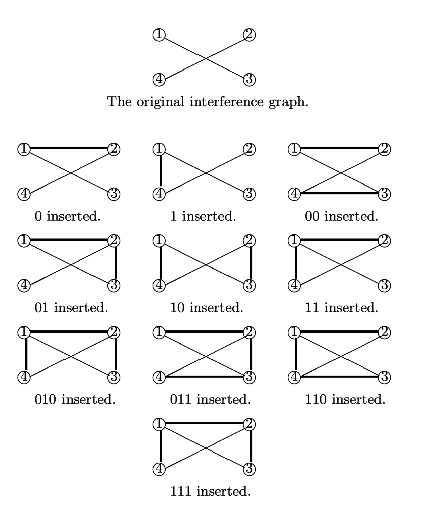

# 3. Embedding and Extracting

ソフトウェア透かしでは2つの基本的なことを行わなければならない。

1. ソフトウェアオブジェクトに対して埋め込みを行うこと
2. それによってソフトウェアに埋め込まれたすべての透かしbitを抽出する、もしくは埋め込まれた透かしが存在するか否かを認識すること

本章では、ソフトウェア透かしの埋め込みと抽出に関するいくつかの概念について紹介する。
これらに関しては我々の以前の研究[46]ですでに述べられている。

Section 4 で取り上げる認識問題に関する議論では、抽出に関する問題についての概念が必要になるがそれらはこの論文の焦点ではない。

## 3.1. Embedding

正確さを欠いて簡単に説明するならば、ソフトウェアに透かしを埋め込むことはプログラムのコードに秘密情報を挿入することである。
この概念を以下のように、形式的に定義する。

---

### Definition 1. (Watermark)

透かしは長さ0以上の有限長のbit列からなるメッセージである。
すべての透かしの集合を $\bf{W}$ とする。

---

### Definition 2. (Embedding)

$\bf{P}$ をプログラムの集合、$\bf{W}$ を透かしの集合とする。
関数 $A: \bf{P} \times \bf{W} \rightarrow \bf{P}$ を透かし埋め込みアルゴリズム、あるいは単に埋め込み器と呼ぶ。
ある$P \in \bf{P}$、$W \in \bf{W}$ について、$P' = A(P, W)$ は (埋め込み器 $A$ に関して) 透かし入りプログラムであると呼ばれる。
また、$P$ は $P'$ の元のプログラムと呼ばれる。

---

本論文で定義された概念について説明するため、具体的なソフトウェア透かしアルゴリズムである QPアルゴリズム を例に上げて説明する。

## 3.2. The QP Watermarking Algorithm

Qu と Potkonjak は グラフ彩色 (GC: Graph Coloring) 問題[30][31]の *watermarking solution* であるQPアルゴリズム[21][39][40]と呼ばれる透かしアルゴリズムを提案した。
このアルゴリズムはグラフの頂点にインデックスをつける必要がある。
つまり、各頂点は固有の整数 $1$ から $\|V(G)\|$ でラベル付けされる。
QPアルゴリズムはノードのインデックスの順序付けに大きく依存する。
以下はQPアルゴリズムで使用される概念である。

### Definition 3. 循環剰余 $n$ の順序[30][31]

記号 $<_i$ で、ある数 $i$ についての循環剰余 $n$ の順序付けを $i <_i (i+ 1) <_i ...<_i n <_i 1 <_i ··· <_i i−1$ のように表現する。
混乱がない場合には $<_i$ の添字 $i$ を省略する。

### Definition 4. 頂点 $v_i$ に接続していない2つの最近傍頂点[30, 31]

$\|V\|=n$ であるグラフ $G$ の頂点 $v_i$ について、$v_{i_1}, v_{i_2} \in V$ が以下を満たすとき、$v_{i_1}$、$v_{i_2}$ を $v_i$ に接続していない2つの最近傍頂点であるという。

- $i <_i i_1 <_i i_2$
- $(v_i, v_{i_1}) \notin E$ かつ $(v_i, v_{i_2}) \notin E$
- 任意の $j, i <_i j <_i i_1$ について $(v_i, v_j) \in E$
- 任意の $j, i_1 <_i j <_i i_2$ について $(v_i, v_j) \in E$

本論文では、$v_i$ について上記の2つの頂点が存在するならば、$v_i$ は2つの候補頂点 $v_{i_1}$, $v_{i_2}$ を持つという。

QPアルゴリズムの本質は、すべての頂点 $v_i$ とその候補頂点のうちの1つの間にエッジを追加することである。
埋め込まれる透かしbitはこれら2つの最近傍頂点の選択によって決定される。
エッジが $v_i$ に追加されるたび、2つの候補頂点が動的に変わる可能性があるため注意する。

Fig. 1 に示す元のQPアルゴリズム Qu と Potkonjak によって提案された[30][31]。
これはGC問題の解法に透かしを埋め込む。

```c
Input:  透かしの埋め込まれていない n=|V| のグラフ G と
        メッセージbit: W = w1 w2 ... wm (メッセージ長 m)
Output: 透かしの埋め込まれたグラフ G'

Algorithm:
G' := G // G'は透かしの埋め込まれたグラフ
j  := 1 // jは次に埋め込む透かしの位置
if m > n then // WのすべてのbitをGに挿入できない
    return G
for i in (1 ... n) do
    if j > m then // WのすべてのbitをすでにGに挿入し終えている
        return G'
    if vi に接続されていない2つの最近傍頂点 vi1, vi2 を見つける then
        if wj = 0 then
            vi と vi1 を接続する
        else
            vi と vi2 を接続する
        j++
if m ≥ j then // WのすべてのbitをGに埋め込むことができなかった
    return G
return G
```
**Figure 1: QPアルゴリズム**

## 3.3. Extraction

<!-- textlint-disable preset-japanese/no-doubled-joshi -->
埋め込み器によって透かしをカバーメッセージへ挿入したあと、重要になるのはその透かしを抽出するためのアルゴリズムが存在するか否かである。
<!-- textlint-enable preset-japanese/no-doubled-joshi -->

次の定義は埋め込み器がプログラムに挿入できる潜在的に埋め込めるすべての透かしメッセージについて規定する。
そのメッセージの集合に、カバープログラムを変更しないようなものは含まれない。

---

### Definition 5. (Set of candidate watermarks)

$A(P, W) \ne P$ である $W \in \bf{W}$ はプログラム $P$ と埋め込み器 $A$ に関する **候補透かし**(*a candidate watermark*) と呼ばれる

すべての候補透かしはプログラム $P$ と埋め込み器 $A$ に関して候補透かしの集合を構成する。
この集合を候補 $(P, A)$ と呼ぶ。

---

このプログラム $P$ と埋め込み器 $A$ に関する候補透かしの集合 $A$ によって $P$ に挿入することのできるすべての透かしの集合である。
その他の透かしを $P$ に埋め込もうとしても、元のプログラムは変更されない。
この概念は抽出を定義するうえで重要になる。

---

### Example 1. (Set of candidate watermarks)

<!-- textlint-disable preset-ja-technical-writing/max-comma -->
$A$ を Fig. 1 に示したQPアルゴリズムとする。
今、$P$ は4つの頂点 $v_1, v_2, v_3, v_4$ と2つの辺 $(v_1, v_3), (v_2, v_4)$ からなる **干渉グラフ**(*the interference graph*) を持つプログラムである。

このとき、$A$ と $P$ に関する候補透かしの集合は $\{0, 1, 00, 01, 10, 11, 010, 011, 110, 111\}$ である。
元のプログラムの干渉グラフと透かしの埋め込まれたプログラムを Fig. 2 に示す。
<!-- textlint-enable preset-ja-technical-writing/max-comma -->


**Figure 2: 元のプログラムと透かしの埋め込まれたプログラムの干渉グラフ**

Fig. 2 から分かるとおり、$010$ の埋め込まれたグラフと $111$ の埋め込まれたグラフは同じである。
このため、QPアルゴリズムで埋め込まれた透かしを正確に抽出することはできない。

---

### Definition 6. (Extractor)

$A$ を埋め込み器とする。
関数 $X : \bf{P} × \bf{P} \rightarrow \bf{W}$ が以下の特徴を満たすならば、$A$ に関する抽出器と呼ばれる。

任意の $P \in \bf{P}, W \in \bf{W}$ について、
- $W \in \rm{候補透かし} \; (P, A)$ かつ $P' = A(P, W)$ ならば $X(P', P) = W$
- そうでなければ $X(P', P) = \epsilon$

---

### Definition 7. (Extractable)

埋め込み器 $A$ に関する抽出器 $X$ が存在するとき、埋め込み器 $A$ によって埋め込まれた透かしが抽出可能であるという。

---

### Example 2. (The QP embedding algorithm in Fig. 1 is not extractable)

[46]より、Fig. 1 に示したQPアルゴリズムは抽出可能でないことがわかる。

---
