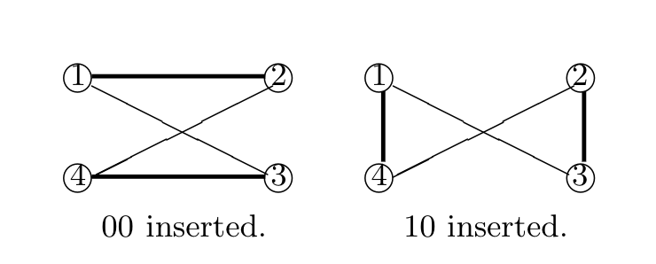

# 4. Recognition

状況によっては、ソフトウェアに埋め込まれたすべての透かしbitを抽出する必要はないこともある。
どのソフトウェアに透かしが埋め込まれているかのみを知りたい場合である。

また他の状況では、ソフトウェア透かし埋め込み器が本質的に抽出不可能であったり、もしくは抽出可能であったとしても抽出器がなんらかのアプリケーションに対して非効率的であるような場合もある。

本章では、ソフトウェアに埋め込まれた透かしの存在を判定する問題について議論する。
以下の節では、**知識あり認識**(*informed recognition*) について取り扱う。
第1引数が透かしの存在をテストするプログラム、第2引数がもとのプログラムであるような、2引数の認識関数である。

## 4.1. Recognizers and Partial Recognizers

実際にプログラムへ透かしが埋め込まれていれば認識器がそれを検出するが、透かしが埋め込まれていないにもかかわらずプログラムが透かしを持っていると判定するかもしれないような認識をポジティブ部分認識という。

---

### Definition 8. (Positive-partial recognition)

埋め込み器 $A : \bf{P} \times W \rightarrow \bf{P}$ について、 関数 $R : P \times P \rightarrow \{TRUE, FALSE\}$ が以下を満たすならば、$R$ を埋め込み器 $A$ に関するポジティブ部分認識関数と呼ぶ。

<!-- textlint-disable preset-ja-technical-writing/max-comma -->
- 任意の $P, P' \in \bf{P}$ について $P' = A(P, W)$ であるような $W \in candidate(A, P)$ が存在すれば $R(P', P) = TRUE$ である。
<!-- textlint-enable preset-ja-technical-writing/max-comma -->
--W \in candidate-

実際にプログラムへ透かしが埋め込まれていれば認識器がそれを検出するが、透かしが埋め込まれているにもかかわらずプログラムが透かしを持っていないと判定するかもしれないような認識をネガティブ部分認識という。

- のうちのいずれかと一致するかの判定によって構成できる。--

埋め込み器 $A : \bf{P} \times W \rightarrow \bf{P}$ について、 関数 $R : P \times P \rightarrow \{TRUE, FALSE\}$ が以下を満たすならば、$R$ を埋め込み器 $A$ に関するポジティブ部分認識関数と呼ぶ。

- 任意の $P, P' \in \bf{P}$ について $R(P', P) = TRUE$ ならばある $W \in \bf{W}$ について $P' = A(P, W)$ である。

---

(部分認識に対して) 完全な認識器はプログラム中の透かしの有無を正確に判定できる。

---

### Definition 10. (Recognizer)

埋め込み器 $A : \bf{P} \times W \rightarrow \bf{P}$ について、 関数 $R : P \times P \rightarrow \{TRUE, FALSE\}$ が以下を満たすならば、$R$ を埋め込み器 $A$ に関する完全認識関数と呼ぶ。

<!-- textlint-disable preset-ja-technical-writing/max-comma -->
- 任意の $P, P' \in \bf{P}$ と、ある $W \in candidate(A, P)$ について $R(P', P) = TRUE \Longleftrightarrow P' = A(P, W)$ である。
<!-- textlint-enable preset-ja-technical-writing/max-comma -->

また、$A$ に関する認識器が存在するとき、$A$ を認識可能であるという。

---

<!-- textlint-disable preset-japanese/no-doubled-conjunction -->
$A$ が抽出可能であれば認識可能でもある。
$X$ を $A$ に関する抽出アルゴリズムとするとき、認識関数 $R(P', P)$ は抽出された透かし $X(P', P)$ が $W \in candidate(A, P)$ のうちのいずれかと一致するかの判定によって構成できる。
<!-- textlint-enable preset-japanese/no-doubled-conjunction -->

---

### Theorem 1.

すべての埋め込み器 $A$ について、唯一の認識器が存在する。
その $A$ に関する唯一の認識器を $Reg(A)$ と表す。

**証明**:

任意の $P, P' \in \bf{P}$ について、 $R(P', P)$ を以下のように定義する。

- $P' = A(P, W)$ となる、ある $W \in candidate(A, P)$ が存在するならば $R(P', P) = TRUE$
- そうでなければ $R(P', P) = FALSE$

$R$ は明らかに $A$ の認識器である。

---

Theorem 1 と Example 2 よりすべての埋め込み器が抽出可能ではないことがわかるが、一方ですべての埋め込み器は認識可能である。

Theorem 1 は唯一の抽象的な認識器が存在していることを示しているが、そのような認識器を実現する具体的な認識アルゴリズムは複数存在する可能性がある。

---

### Property 1.

すべての $A$ について、$Reg(A)$ は $A$ に関するポジティブ/ネガティブ両方の部分認識器である。

---

上記の概念を説明するため、4つの例を示す。

---

### Example 3. (Trivial partial recognizers)

部分認識の概念はとても柔軟だ。
以下はいくつかの *trivial partial recognitions* である。

認識器 $A : \bf{P} \times \bf{W} \rightarrow \bf{P}$ について、関数 $S : \bf{P} \times \bf{P} \rightarrow \{TRUE, FALSE\}$ を $P', P \in \bf{P}$ を用いて $S(P', P) = TRUE$ と定義する。
これは $A$ に関するポジティブ部分認識である。

このような関数 $S$ を、$A$ に関する *trivial positive-partial recognizer* と呼び、$TrivPP(A)$ と表す。

また、$S(P', P) = FALSE$ は *trivial negative-partial recognizer* であり、$TrivNP(A)$ と表す。

---

### Example 4. (A positive-partial recognizer for the QP algorithm)

QPアルゴリズムのポジティブ部分認識器を Fig. 4 に示す。
Example 1 で示したプログラムの干渉グラフをこの認識器で認識すると Fig. 3 のような結果が得られる。


**Figure 3: ポジティブ部分認識器の干渉グラフ**

```c
Input:  透かしの埋め込まれていない n = |V| のグラフ G(V, E)
        透かしの埋め込まれたグラフ G'
Output: G' にメッセージ W が埋め込まれているかどうか
Algorithm:
if G が G' の部分グラフでない then
    return FALSE
j := 0
for i in (1 ... n) do
    if G の vi に接続されていない2つの最近傍頂点 vi1, vi2 を見つける then
        j++
        if (vi, vi2) ∈ G' then
            G の vi と vi2 を接続する
        else if (vi, vi1) ∈ G' then
            G の vi と vi1 を接続する
        else // すべてのbitが抽出された
            exit
if j=0 then
    return FALSE
return TRUE
```
**Figure 4: QPアルゴリズムのポジティブ部分認識器**

---

### Example 5. (A negative-partial recognizer for the QP algorithm)

QPアルゴリズムのネガティブ部分認識器を Fig. 6 に示す。
Example 1 で示したプログラムの干渉グラフをこの認識器で認識すると Fig. 5 のような結果が得られる。


**Figure 5: ネガティブ部分認識器の干渉グラフ**

```c
Input:  透かしの埋め込まれていない n = |V| のグラフ G(V, E)
        透かしの埋め込まれたグラフ G'
Output: G' にメッセージ W が埋め込まれているかどうか
Algorithm:
if G が G' の部分グラフでない then
    return FALSE
j := 0
for i in (1 ... n) do
    if G の vi に接続されていない2つの最近傍頂点 vi1, vi2 を見つける then
        j++
        if (vi, vi2) ∈ G' then
            G の vi と vi2 を接続する
        else if (vi, vi1) ∈ G' then
            G の vi と vi1 を接続する
        else
            return FALSE
if j=0 then
    return FALSE
return TRUE
```
**Figure 6: QPアルゴリズムのネガティブ部分認識器**

---

### Example 6. (A recognizer for the QP algorithm)

QPアルゴリズムの認識器を Fig. 7 に示す。

```c
Input:  透かしの埋め込まれていない n = |V| のグラフ G(V, E)
        透かしの埋め込まれたグラフ G'
Output: G' にメッセージ W が埋め込まれているかどうか
Algorithm:
if G が G' の部分グラフでない then
    return FALSE
j := 0
for i in (1 ... n) do
    if G の vi に接続されていない2つの最近傍頂点 vi1, vi2 を見つける then
        j++
        if (vi, vi2) ∈ G' then
            G の vi と vi2 を接続する
        else if (vi, vi1) ∈ G' then
            G の vi と vi1 を接続する
        else
            return FALSE
if j=0 then
    return FALSE
if |E'|≠|E|+j then
    return FALSE
return TRUE
```
**Figure 7: QPアルゴリズムの認識器**

---

極端にポジティブな部分認識器は常にプログラムに透かしが含まれていると識別し、極端にネガティブな部分認識器は常にプログラムに透かしが含まれていないと識別する。

通常これら2つの認識器は便利でない。
次は2つの認識関数の相対的な強度について考える。

---

### Definition 11. (Strength of partial recognizers)

$PP1, PP2$ をそれぞれ埋め込み器 $A$ に関するポジティブ部分認識器とする。
もし任意の $P, P' \in \bf{P}$ について $PP2(P', P) = TRUE \Longrightarrow PP1(P', P) = TRUE$ ならば、 $PP2$ は少なくとも $PP1$ と同じ強度であるという。

$NP1, NP2$ をそれぞれ埋め込み器 $A$ に関するネガティブ部分認識器とする。
もし任意の $P, P' \in \bf{P}$ について $NP1(P', P) = TRUE \Longrightarrow NP2(P', P) = TRUE$ ならば、 $NP2$ は少なくとも $NP1$ と同じ強度であるという。

---

### Property 2.

<!-- textlint-disable preset-japanese/no-doubled-joshi -->
認識器 $A$ について、$TrivPP(A)$ はもっとも弱いポジティブ部分認識器であり、$Reg(A)$ はもっとも強い部分認識器である。
また、$TrivNP(A)$ はもっとも弱いネガティブ部分認識器であり、$Reg(A)$ はもっとも強い部分認識器である。
<!-- textlint-enable preset-japanese/no-doubled-joshi -->

---

## 4.2. Blind recognizers

状況によっては、透かしを検出する際に元のプログラムが使用できないこともある。
元のプログラムを利用せずに認識を行うことをブラインド認識という。

---

### Definition 12. (Blind and informed recognizer)

埋め込み器 $A : \bf{P} \times \bf{W} \rightarrow \bf{P}$ と関数 $S : \bf{P} \rightarrow \{TRUE, FALSE\}$ について、以下の定義を与える。

- $S$ が任意の $P' \in \bf{P}$ について以下の特性を持つ場合、$S$ を埋め込み器 $A$ に関するブラインドポジティブ部分認識器と呼ぶ。

    - $P' = A(A, W)$ となる $P \in \bf{P}$ と $W \in candidate(A, P)$ が存在するとき、$S(P') = TRUE$

- $S$ が任意の $P' \in \bf{P}$ について以下の特性を持つ場合、$S$ を埋め込み器 $A$ に関するブラインドネガティブ部分認識器と呼ぶ。

    - $S(P') = TRUE$ ならば $P' = A(A, W)$ となる $P \in \bf{P}$ と $W \in candidate(A, P)$ が存在する

- $S$ が任意の $P' \in \bf{P}$ について以下の特性を持つ場合、$S$ を埋め込み器 $A$ に関するブラインド認識器と呼ぶ。

    - $S(P') = TRUE$ であることが $P' = A(A, W)$ となる $P \in \bf{P}$ と $W \in candidate(A, P)$ が存在することと同値である

$A$ に関するブラインド認識アルゴリズムが存在するとき、 $A$ はブラインド認識可能であるという。

$S$ が $A$ に関するブラインド認識器であるとき、組合せ $(A, S)$ をブラインド透かし認識アルゴリズムと呼ぶ。

---

ブラインド認識器は知識あり認識器よりも実用的であり、同様の理由からブラインド抽出は知識あり抽出よりも実用的である。
以下に、ブラインド認識器を説明する2つの例を示す。

Example 7 は埋め込み器と、それに関するブラインド認識器を提示する

---

### Example 7. (A blind recognizer)

埋め込み器 $A$ を以下のように定義する。

- すべてのプログラム $P$ について、$W = 101$ または $W = 110$ のとき、$A(P, W)$ は $P$ に追加の定数宣言を加えたものである。そうでなければ $A(P, W) = P$ とする。

$A$ に関するブラインド認識器 $S$ を以下のように定義する。

<!-- textlint-disable preset-japanese/no-doubled-joshi -->
- 任意の $P' \in \bf{P}$ について、$P'$ が1つ以上の定数宣言を持つならば $S(P') = TRUE$、そうでなければ $S(P') = FALSE$ とする。
<!-- textlint-enable preset-japanese/no-doubled-joshi -->

---

### Theorem 2.

すべての埋め込み器 $A$ について、唯一のブラインド認識器が存在する。
そのような $A$ に関する唯一のブラインド認識アルゴリズムを $BReg(A)$ と書く。

**証明**:

任意の $P, P' \in \bf{P}$ について、$R(P', P)$ を以下のように定義する

<!-- textlint-disable preset-ja-technical-writing/max-comma -->
- $P' = A(P, W)$ である $P \in \bf{P}$ と $W \in candidate(A, P)$ が存在するとき $R(P', P) = TRUE$、そうでければ $R(P', P) = FALSE$
<!-- textlint-enable preset-ja-technical-writing/max-comma -->

$R$ が $A$ に関するブラインド認識器であることは明らかである。

---

### Property 3.

すべての $A$ について、$BReg(A)$ は $A$ に関するポジティブ部分認識器かつネガティブ部分認識器である。

---

### Example 8. (Trivial blind partial recognizers)

ブラインド部分認識器の概念もまた柔軟である。

以下は**trivialブラインド部分認識器** である。

埋め込み器 $A : \bf{P} \times \bf{W} \rightarrow \bf{P}$ について、$S(P) = TRUE$ と定義する。この定数関数は $A$ に関するブラインドポジティブ認識器であり、$TrivBPP(A)$ と書く。

埋め込み器 $A : \bf{P} \times \bf{W} \rightarrow \bf{P}$ について、$S(P) = FALSE$ と定義する。この定数関数は $A$ に関するブラインドネガティブ認識器であり、$TrivBNP(A)$ と書く。

---

埋め込み器 $A$ について、複数のブラインドポジティブ認識器とブラインドネガティブ認識器が存在する。
それらに関する強度を決定する必要がある。

---

### Definition 13. (Strength of blind partial recognizers)

$BPP1$ と $BPP2$ を埋め込み器 $A$ に関するブラインドポジティブ部分認識器とする。
もし任意の $W \in \bf{W}$ と 任意の $P' \in \bf{P}$ について、$BPP2(P') = TRUE \Longrightarrow BPP1(P') = TRUE$ ならば、$BPP2$ は $BPP1$ よりも強い。

$BNP1$ と $BNP2$ を埋め込み器 $A$ に関するブラインドネガティブ部分認識器とする。
もし任意の $W \in \bf{W}$ と 任意の $P' \in \bf{P}$ について、$BNP1(P') = TRUE \Longrightarrow BNP2(P') = TRUE$ ならば、$BNP2$ は $BNP1$ よりも強い。

---

### Property 4.

<!-- textlint-disable preset-japanese/no-doubled-joshi -->
すべての埋め込み器 $A$ について、$TrivBPP(A)$ はもっとも弱いブラインドポジティブ部分認識器であり、$BReg(A)$ はもっとも強い ブラインドポジティブ部分認識器である。

同様に $TrivBNP(A)$ はもっとも弱いブラインドネガティブ部分認識器であり、$BReg(A)$ はもっとも強い ブラインドネガティブ部分認識器である。
<!-- textlint-enable preset-japanese/no-doubled-joshi -->

---
