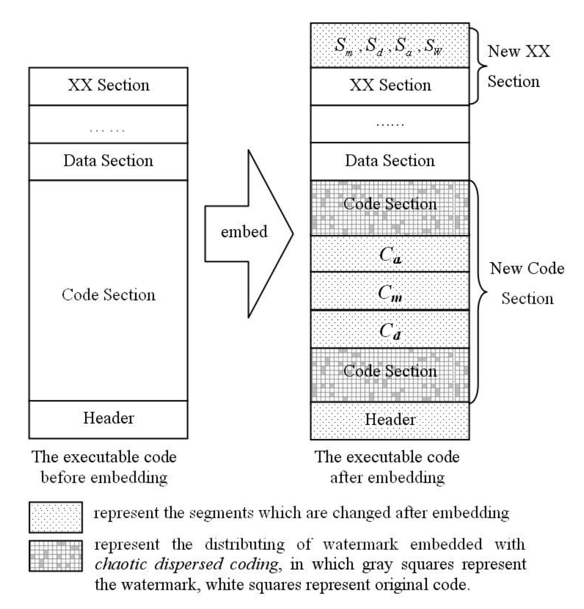

# 3. Embedding and Extraction of the CRSW

本節では、\(P\)に対しどのように\(W\)、\(C_m\)、\(C_d\) および \(C_a\) を埋め込むのかについて論じる。
\(C_m\)、\(C_d\)、\(C_a\) の構築については次節で述べる。

埋め込みと抽出について述べる前に、カオス置換 (***chaotic substitution***) とカオス分散符号化 (***chaotic dispersion coding***) について説明する。

## 3.1. Chaotic Substitution \(\partial\)

カオス置換 (***chaotic substitution***) は \(i\) を \(c\) に置き換えることであり (\(c\)、\(i\) は8bitの2進整数)、その結果 \(i\) の値は \(c\) と等しくなり \(s\) が得られる。
\(c\) と \(s\) から、逆カオス置換 (***reverse chaotic substitution***) によって元の \(i\) の値を復元できる。

\(G\) をデジタルカオスシステムとする。
一般性を損なうことなく、\(G\) の状態空間を \([a,b)\)。
このとき、カオス置換は以下のように表される。

\[
    s = \partial(i,c,G) \\
      = \left\lfloor 2^8 \times \frac{G(x,m) - a}{b-a} \right\rfloor \oplus i,
\]
\[
    x = \frac{c(b-a)}{2^8} + a, \tag{1}
\]
\[
    m = \left\lfloor \frac{c}{\lambda} \right\rfloor + 1
\]

ただし、\(\oplus\) はXORを意味する。
ここで、\(G(x,m)\) は初期値 \(x\) で \(m\) 回反復した \(G\) の状態であり、\(lambda\) は反復回数を調整できるパラメータである。

逆カオス置換は次式で与えられる。

<!-- textlint-disable -->

\[
    i = \partial^{-1}(s,c,G) = \partial(s,c,G) \tag{2}
\]

一般に、集合 \(A = \{\alpha_1, \alpha_2, \dots, \alpha_k\}\) によって \(B = \{b_1, b_2, \dots, b_k\}\) が置き換えられ、結果として以下が得られる。

\[
    R = \{r_j\} = \partial(B,A,G) = \{\partial(b_j,a_j,G)\}, \quad j=1,2,\dots,k \tag{3}
\]

逆カオス置換は以下のようになる。

\[
    B = \partial^{-1}(R,A,G) = \partial(R,A,G) \tag{4}
\]

<!-- textlint-enable -->

## 3.2. Chaotic Dispersion Coding \(\xi\)

<!-- textlint-disable -->
\(X = \{x_1, x_2, \dots, x_n\}\) をカオスシーケンスとする。
一般性を損なわずに、\(x_j \in [a,b), \quad j=1,2,\dots,n\) と仮定する。
カオス分散符号化は \(W\) を \(I\) (プログラムのコード) に分散する。
<!-- textlint-enable -->

\[
    [I',S'] = \xi(W,I,X) \tag{5}
\]

ここで \(I'\) は結果として得られるコードであり、\(S\) はセーブコード (**save code**) である。

<!-- textlint-disable -->
\(W\) の長さを \(n\) byte、\(I\) の長さを \(l\) byte とする。
つまり、\(W = \{w_1, w_2, \dots, w_n\}\)、\(I = \{i_1, i_2, \dots, i_l\}\)、\(S = \{s_1, s_2, \dots, s_n\}\) である。
<!-- textlint-enable -->

\(\xi\) の手順は以下である。

1. 初期化:

    \(L \leftarrow l\)、 
    \(N \leftarrow n\)、 
    \(m \leftarrow \lfloor L/N \rfloor\)、 
    \(j \leftarrow i\)、 
    \(d \leftarrow 0\)、 
    \(I' = \{i'_1, i'_2, \dots, i'_l\} = I\) とする.

2. \(r = \lfloor m \times \frac{x_j-a}{b-a} \rfloor\), 
    \(d = d + r\), 
    \(s'_j = \partial(i_d,w_j,G)\), 
    \(i'_d = w_j\) とする。

3. \(j = n\) ならばアルゴリズムは完了である。そうでなければ 4. へ。

4. \(L = L - r\)、 
    \(N = N - 1\)、 
    \(m = \lfloor L/N \rfloor\)、 
    \(j = j + 1\)、 2. へ。

逆カオス分散符号化によって \(S'\) と \(I'\) から \(W\) と \(I\) が復元され、この処理を \([I,W] = \xi^{-1}(S',I',X)\) と表す。

## 3.3. Embedding

CBSWでは、\(W\)、\(C_m\)、\(C_d\) および \(C_a\) のすべてが実行可能コードに直接埋め込まれる。
この埋め込み処理を以下で説明する (図2 は埋め込み前後の実行可能コードの変化を表している)。

**図2: 透かしの埋め込み**

<!-- textlint-disable -->
1. 鍵 \(<K_1,K_2>\) が与えられる (\(K_1\) は活性化鍵、\(K_2\) はカオスシーケンスの生成鍵である)。透かしの長さを \(n\) byteとすると、\(W\) は \(\{w_1,w_2,\dots,w_n\}\) と表せる。

2. 透かし復号モジュール \(C_d\) とアンチリバースエンジニアリングモジュール \(C_a\) を構築する。また入力監視モジュール \(C_m\) を活性化鍵 \(K_1\) から構築する (各モジュールの構築方法は次節で述べる)。

3. カオスシーケンス \(X = \{x_1,x_2,\dots\}\) を処理する。

4. プログラム \(P\) のコードに \(C_m\)、\(C_d\)、\(C_a\) を埋め込むためにカオス置換を適用する。\(C_m\)、\(C_d\)、\(C_a\) に置き換えられるコードブロックをそれぞれ \(I_m\)、\(I_d\)、\(I_a\) とする。

    デジタルカオスシステム \(G\) とすると、\(S_m=\partial(I_m,C_m,G)\)、\(S_d=\partial(I_d,C_d,G)\)、\(S_a=\partial(I_a,C_a,G)\) が得られる。

5. \(X\) の長さ \(n\) のサブシーケンス \(X^{(1)}\) を得る。

    \(W\) の前処理 \(W'=E(W,X^{(1)})=W \oplus X^{(1)}=\{w'_1,w'_2,\dots,w'_n\}=\{w_1 \oplus x^{(1)}_1,w_2 \oplus x^{(1)}_2,\dots,w_n \oplus x^{(1)}_n\}\) を行う (\(\oplus\) はXOR)。
<!-- textlint-enable -->

6. \(X\) の長さ \(n\) のサブシーケンス \(X^{(2)}\) を得る。

    \(I\) を \(C_m\)、\(C_d\)、\(C_a\) に置き換えられたコードを除いたコード全体とする。
    カオス分散符号化によって \(W'\) を \(I\) に埋め込み、\([I',S_W]=\xi(W',I,X^{(2)})\) を得る (図2 は透かし入りのプログラムにおける \(W'\) の分布を表している)。

7. \(S_m\)、\(S_d\)、\(S_a\)、\(S_W\) を実行可能コードの末尾に保存し、実行可能コードのヘッダを調整する。
