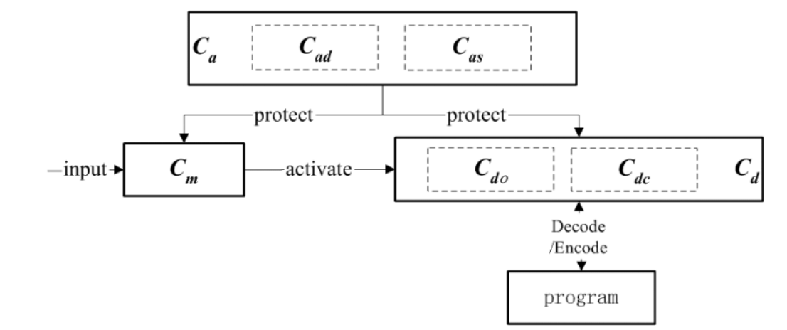

# 2. The Structure of CRSW

<!-- textlint-disable -->
イースターエッグ透かしはもっとも広く用いられている動的手法の一種である [1,8]。
この透かし手法は、本質的には電子透かしの検出機構 (または抽出器) をプログラム直接埋め込むものである。
特殊な入力シーケンスに対し、検出器 (または抽出器) が作動し、透かしの施されたプログラムから抽出された透かしが表示される。
このように、検出手順 (または抽出手順) のセマンティクスはプログラム自身のセマンティクスに含まれているため、意味保存変換攻撃に耐性を持つ [10]。
イースターエッグ透かしの主な問題点は、一度正しい入力シーケンスが発見されると標準的なデバッグ技術で実行可能コード内の透かしの位置が特定され、透かしの削除や無効化が行われうることである [8]。
さらに、通常はプログラムの一部に透かしが埋め込まれているだけのため、不正な再利用を目的にプログラムの特定のモジュールのみを切り取る攻撃への耐性がない [10]。
<!-- textlint-enable -->

本論文では、イースターエッグ透かしの考え方に基づき、より堅牢で実現可能性の高いソフトウェア透かしCRSWを提案する。
この手法は4つの重要な部分からなっている。

- 透かし \(W\)
- 入力監視モジュール \(C_m\)
- 透かし復号モジュール \(C_d\)
- アンチリバースエンジニアリングモジュール \(C_a\)

CRSWは他の透かし手法とは異なり、透かし \(W\) のみでなく \(C_m\)、\(C_d\)、\(C_a\) も、実行可能コードとしてプログラムに埋め込む。
本節では、\(C_m\)、\(C_d\)、\(C_a\) を含むCRSWの構造と相互関係について述べる (図1を参照)。

**図1: CRSW埋め込みコードの構造と相互関係**

#### 記号の定義

<!-- textlint-disable -->
\(P\) をプログラム、\(\{\alpha_1, \alpha_2, \dots\}\) をプログラムの受容可能な入力の集合、\(P' = T(P, W, C_m, C_d, C_a)\) を透かしの埋め込まれたプログラムとする (\(T\) は透かし埋め込み変換)。

抽出手順は、\(\widetilde{W} = D(\Gamma(P'))\) である。
ここで、\(D\) は抽出変換、\(\Gamma\) はコード変換である。
透かし入りのプログラムが攻撃されていた場合 \(\Gamma\) は攻撃変換を意味する。攻撃を受けていない場合 \(\Gamma\) は恒等変換である。

\(D(\Gamma(P')) \equiv_{cp} W\) が成り立つ場合、\(T\) は \(\Gamma\) に耐性を持つ (\(\equiv_{cp}\) はユーザ定義の等値関係である)。

#### 入力監視モジュール

入力監視ジュールは写像 \(\Psi: \{\alpha_1, \alpha_2, \dots\} \longmapsto \{0, 1\}\) を実現する。
\(\Psi(\alpha_i) = 1\) が成り立つならば、復号モジュール \(C_d\) が活性化する。
\(\alpha \in \Sigma = \{\alpha_i | \Psi(\alpha_i) = 1\}\) が活性化鍵 (***activation key***) として定義される。
<!-- textlint-enable -->

#### 埋め込み手順

透かし復号モジュールを明確に説明するために、まず透かし埋め込み手順について簡潔に説明する。

まず、\(W\) に前処理を行い \(W' = E(W,G)\) を得る。
ここで \(G\) はデジタルカオス系である。

次にカオス分散符号化 (***chaotic dispersion coding***) を用いてプログラムに \(W'\) を埋め込み、コード \(I_{ew} = \Omega(W',I,G)\) を得る。
ここで、\(I\) はプログラムのコードである (カオス分散符号化については次節で解説する)。

#### 透かし復号モジュール

透かし復号モジュールは、透かしの埋め込まれたプログラムから透かし \(\widetilde{W}\) を抽出し、その可視化を行う。
復号モジュールは透かし出力モジュール \(C_{do}\) と カオス系モジュール \(C_{dc}\) で構成されている。

#### 抽出手順

抽出手順では、まずカオス分散逆符号化 (***reverse chaotic dispersion coding***) \(\widetilde{W'} = \Omega^{-1}(I_{ew}, G)\) によって \(\widetilde{W'}\) を抽出する。

次に、\(\widetilde{W} = E^{-1}(\widetilde{W'},G)\) によって透かし \(\widetilde{W}\) を得る。

最後に \(C_{do}\) が \(\widetilde{W}\) を可視化アクションによって変換し、得られた \(V_{\widetilde{W}}\) をユーザに提示する。

#### アンチリバースエンジニアリングモジュール

アンチリバースエンジニアリングモジュールはアンチ静的解析モジュール \(C_{as}\) とアンチ動的デバッギングモジュール \(C_{ad}\) からなり、\(C_m\)、\(C_d\) のリバースエンジニアリング攻撃から保護する。

\(C_{as}\) は静的解析技術を用いており、\(C_{ad}\) は動的デバッギング技術を用いている。
