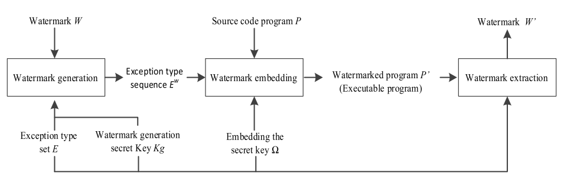

# 2. Exception Handling Dynamic Watermarking Algorithm

## 2.1. Algorithm Framework

提案アルゴリズムは透かしの構築、埋め込み、そして抽出からなる。
アルゴリズムの概要を図1に示す。

**図1: アルゴリズムの概要**

埋め込まれる透かしは、元の透かし \(W\) を、与えられた例外型の集合 \(E\) と透かし生成鍵 \(Kg\) を用いて例外型の列のとして符号化することで生成される。
埋め込み鍵 (プログラムに対する秘密の入力) を用いて、ターゲットプログラム \(P\) のソースコードに例外処理シーケンスを挿入することで透かしが埋め込まれる。
透かしはプログラムの実行中に直接抽出される。
抽出鍵を用いてプログラムを実行し、トリガーされた例外を監視することで埋め込まれた例外型の列を取得する。
次に、透かし生成鍵 \(Kg\) を用いて透かし \(W'\) を復元する。

## 2.2. Watermark Generation

透かし \(W\) を \(l\) bitのバイナリ列、与えられた例外型の集合 \(E=\{e_0,e_1,\dots,e_{n-1}\}\) とする。
透かし生成プロセスの目的は、透かし \(W\) を、生成鍵 \(Kg\) を用いて例外型の列 \(E^W=(e^W_0,e^W_1,\dots,e^W_{s-1})\) に符号化することである。

\(e^W_i \in E \quad (i=0,1,\dots,s-1)\) および \(n=2^m\) は、集合 \(E\) の各例外型が \(m\) bitの透かし片を表せることを示している。
\(s=\left\lceil \frac{l}{m} \right\rceil\) は透かし片の数である。
詳細を以下に示す。

<!-- textlint-disable -->
1. 透かし \(W\) (\(l\) bit) を長さ \(m\) で、\(s=\left\lceil \frac{l}{m} \right\rceil\) 個の透かし片に分割することで \(\widetilde{W}=(\tilde{w}_0,\tilde{w}_1,\dots,\tilde{w}_{s-1})\) を得る。\(l\) が \(m\) の倍数でない場合、末尾に \(0\) を付与する。

2. 例外型の集合 \(E=\{e_0,e_1,\dots,e_{n-1}\}\) を鍵 \(Kg\) でシャッフルし、列 \(\widetilde{E}=(\tilde{e}_0,\tilde{e}_1,\dots,\tilde{e}_{n-1}) \; (\tilde{e}_i \in E, \forall i \ne j \; (i,j=0,1, \dots,n-1), \; \tilde{e}_i \ne \tilde{e}_j)\)を得る。

3. 例外型の列 \(E^W=(e^W_0,e^W_1,\dots,e^W_{s-1})\) を \(\widetilde{W}=(\tilde{w}_0,\tilde{w}_1,\dots,\tilde{w}_{s-1})\) (ただし整数 \(i=0,1,\dots,s-1\) について \(\tilde{w}_i \in [0,2^{m-1}]\)) から \(e^W_i=\tilde{e}_{\tilde{w}_i}\) となるように生成する。
<!-- textlint-enable -->

## 2.3. Watermark Embedding

TODO

## 2.4. Watermark Extraction

TODO
