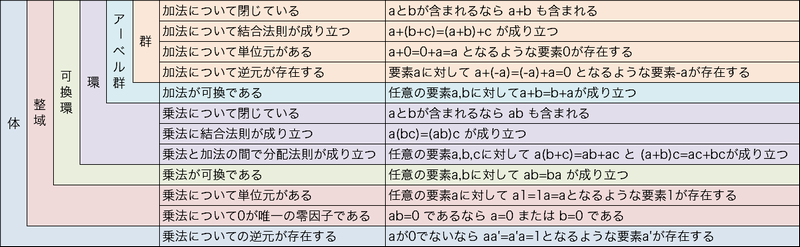

# A.2. Residues. - 剰余

公開鍵暗号方式では、通常 $n$ を法とする剰余を計算する必要がある。

これは計算が **剰余環** (*residue class ring*) $\Z_n$ で行われることを意味する。

## Definition A.14. Residue Classes. - 剰余類

$n$ を正の整数とする。

1. $a$, $b$ が $n$ を法として合同とは、$a-b$ が $n$ で割り切れることを意味し、 $a \equiv b \mod n$ 書く。

    これは、$a$ と $b$ を $n$ で割ったときの剰余が等しいことを表す。

2. $a \in \Z$ とする。

    $[a] := \{ x \in \Z \| x \equiv a \mod n \}$

    は $m$ を法とする $a$ の **剰余類** (*residue class*) と呼ばれる。

3. $\Z_n := \{ [a] \| a \in \Z \}$ は $n$ を法とする剰余類の集合である。

[注]

「$n$ を法として合同」とは **対称的** (*symmetric*) で **反射的** (*reflexive*) で **推移的** (*transitive*) な関係、すなわち **同値関係** (*equivalence relation*) である。

剰余類は **同値類** (*equivalence classes*) である。

剰余類 $[a]$ は要素の1つが分かれば完全に決定される。

$a' \in [a]$ ならば $[a] = [a']$。

$[a]$ の要素 $x \in [a]$ を $[a]$ の **代表元** (*representative*) と呼ぶ。

$n$ との剰余によって $0, ..., n-1$ が得られる。従って、$n$ の剰余類 $\Z_n = \{ [0], ..., [n-1] \}$。

整数 $0, ..., n-1$ は **自然代表元** (*natural representatives*) と呼ぶ。

$[x] \in \Z_n$ の自然代表元は単に 剰余 $x \mod n$ である。

入出力が剰余類であるアルゴリズムを学ぶには剰余類の2進符号化が必要である。$[x] \in \Z_n$ の2進符号は、符号なし整数としての自然代表元 $x \mod n$ の2進符号である。

## Definition A.15. Addition and Multiplication - 加算と乗算

$$ [a] + [b] = [a+b] $$

$$ [a] \cdot [b] = [a \cdot b] $$

$\Z_n$ は $[1]$ を **単位元** (*unit element*) に持つ **可換環** (*commutative ring*) であり、$n$ を法とする **剰余環** (*residue class ring*) と呼ぶ。

## Definition A.16. Unit and Multiplicative Inverse - 単元と逆元

$R$ を単位元 $e$ を持つ可換環とする。

$x,y \in R$ について、$x \cdot y =e$ なる $y$ を持つ $x$ を **単元** (*unit*) と呼ぶ。また、$y$ を $x$ の **逆元** (*multiplicative inverse*) と言う。

単元の部分集合を $R^*$ と表す。

[注]

単元 $x$ の逆元は一意に定まり $x^{-1}$ と表す。

単元の集合 $R^*$ は、乗算について $R$ の部分群である。

[例]

$\Z$ の 単元は $1$ と $-1$ のみである。

剰余環はより多くの単元を持つ。
$p$ を素数とすれば $[0]$ 以外の全ての $\Z_p$ の元は単元である。

$[x] \in \Z_n$ が単元であり、 $[y]$ が $[x]$ の逆元であれば、$[x] \cdot [y] = 1$、従って $x \cdot y - 1$ は $n$ で割り切れる。

## Proposition A.17.

$[x] \in \Z_n$ について、$\gcd(x,n) = 1$ であれば $[x]$ は単元である。

また、その逆元 $[x]^{-1}$ は拡張ユークリッド互除法で計算できる。

[証明]

$\gcd(x,n) = 1$ であれば $xb+nc = 1$ なる $b,c \in \Z$ が存在する。
係数 $b$, $c$ は拡張ユークリッド互除法で求められ、$[b]$ は $[x]$ の逆元である。

逆に、$[x]$ が単元であれば、$x \cdot y = 1 + k \cdot n$ なる $y,k \in \Z$ が存在する。
これは $\gcd(x,n) = 1$ を意味する。

## Corollary A.18.

$p$ を素数とする。$[x] \ne 0$ なる $[x] \in \Z$ は単元である。

従って、$\Z_p$ は **体** (*field*) である。

> 
>
> 出典: **[大人になってからの再学習 (zellij.hatenablog.com): 群・環・体](http://zellij.hatenablog.com/entry/20121211/p1)**

## Definition A.19. The Prime Residue Class Group.

$\Z_n$ の単位元の部分群 $\Z_n^\* := \{ x \in \Z_n \| x \; \rm{は} \; \Z_n \; \rm{の単元} \}$ を、 $n$ を法とした *prime residue class group* と呼ぶ。

## Definition A.20. Cardinality - 基数

$M$ を有限集合とする。

$M$ の要素数を **基数** (*cardinality* / *order*) と呼び、$|M|$ と表す。
