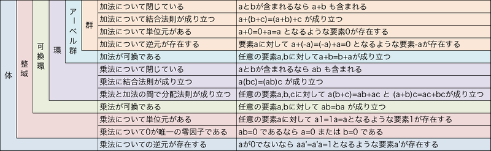

# A.2. Residues. - 剰余

公開鍵暗号方式では、通常 $n$ を法とする剰余を計算する必要がある。

これは計算が **剰余環** (*residue class ring*) $\Z_n$ で行われることを意味する。

## Definition A.14. Residue Classes. - 剰余類

$n$ を正の整数とする。

1. $a$, $b$ が $n$ を法として合同とは、$a-b$ が $n$ で割り切れることを意味し、 $a \equiv b \mod n$ 書く。

    これは、$a$ と $b$ を $n$ で割ったときの剰余が等しいことを表す。

2. $a \in \Z$ とする。

    $[a] := \{ x \in \Z \| x \equiv a \mod n \}$

    は $m$ を法とする $a$ の **剰余類** (*residue class*) と呼ばれる。

3. $\Z_n := \{ [a] \| a \in \Z \}$ は $n$ を法とする剰余類の集合である。

[注]

「$n$ を法として合同」とは **対称的** (*symmetric*) で **反射的** (*reflexive*) で **推移的** (*transitive*) な関係、すなわち **同値関係** (*equivalence relation*) である。

剰余類は **同値類** (*equivalence classes*) である。

剰余類 $[a]$ は要素の1つが分かれば完全に決定される。

$a' \in [a]$ ならば $[a] = [a']$。

$[a]$ の要素 $x \in [a]$ を $[a]$ の **代表元** (*representative*) と呼ぶ。

$n$ との剰余によって $0, ..., n-1$ が得られる。従って、$n$ の剰余類 $\Z_n = \{ [0], ..., [n-1] \}$。

整数 $0, ..., n-1$ は **自然代表元** (*natural representatives*) と呼ぶ。

$[x] \in \Z_n$ の自然代表元は単に 剰余 $x \mod n$ である。

入出力が剰余類であるアルゴリズムを学ぶには剰余類の2進符号化が必要である。$[x] \in \Z_n$ の2進符号は、符号なし整数としての自然代表元 $x \mod n$ の2進符号である。

## Definition A.15. Addition and Multiplication - 加算と乗算

$$ [a] + [b] = [a+b] $$

$$ [a] \cdot [b] = [a \cdot b] $$

$\Z_n$ は $[1]$ を **単位元** (*unit element*) に持つ **可換環** (*commutative ring*) であり、$n$ を法とする **剰余環** (*residue class ring*) と呼ぶ。

## Definition A.16. Unit and Multiplicative Inverse - 単元と逆元

$R$ を単位元 $e$ を持つ可換環とする。

$x,y \in R$ について、$x \cdot y =e$ なる $y$ を持つ $x$ を **単元** (*unit*) と呼ぶ。また、$y$ を $x$ の **逆元** (*multiplicative inverse*) と言う。

単元の部分集合を $R^*$ と表す。

[注]

単元 $x$ の逆元は一意に定まり $x^{-1}$ と表す。

単元の集合 $R^*$ は、乗算について $R$ の部分群である。

[例]

$\Z$ の 単元は $1$ と $-1$ のみである。

剰余環はより多くの単元を持つ。
$p$ を素数とすれば $[0]$ 以外の全ての $\Z_p$ の元は単元である。

$[x] \in \Z_n$ が単元であり、 $[y]$ が $[x]$ の逆元であれば、$[x] \cdot [y] = 1$、従って $x \cdot y - 1$ は $n$ で割り切れる。

## Proposition A.17.

$[x] \in \Z_n$ について、$\gcd(x,n) = 1$ であれば $[x]$ は単元である。

また、その逆元 $[x]^{-1}$ は拡張ユークリッド互除法で計算できる。

[証明]

$\gcd(x,n) = 1$ であれば $xb+nc = 1$ なる $b,c \in \Z$ が存在する。
係数 $b$, $c$ は拡張ユークリッド互除法で求められ、$[b]$ は $[x]$ の逆元である。

逆に、$[x]$ が単元であれば、$x \cdot y = 1 + k \cdot n$ なる $y,k \in \Z$ が存在する。
これは $\gcd(x,n) = 1$ を意味する。

## Corollary A.18.

$p$ を素数とする。$[x] \ne 0$ なる $[x] \in \Z_p$ は単元である。

従って、$\Z_p$ は **体** (*field*) である。

> 
>
> 出典: **[大人になってからの再学習 (zellij.hatenablog.com): 群・環・体](http://zellij.hatenablog.com/entry/20121211/p1)**

## Definition A.19. The Prime Residue Class Group.

$\Z_n$ の単位元の部分群 $\Z_n^\* := \{ x \in \Z_n \| x \; \rm{は} \; \Z_n \; \rm{の単元} \}$ を、 $n$ を法とした *prime residue class group* と呼ぶ。

## Definition A.20. Cardinality - 基数

$M$ を有限集合とする。

$M$ の要素数を **基数** (*cardinality* / *order*) と呼び、$|M|$ と表す。

## Definition A.21. The Eular Phi Function - オイラーの φ 関数

$$ \varphi : \N \longrightarrow \N, n \longmapsto |\Z_n^*| $$

を **オイラーの $\varphi$ 関数** (*Euler phi function*) あるいは **オイラーのトーシェント関数** (*Euler totient function*) と呼ぶ。

> [注釈]
>
> $\varphi(m)$ は $1$ から $m$ までのうち $m$ と互いに素な整数の数になる。

## Proposition A.22.

$$ \sum_{d \| n} \varphi(d) = n $$

[証明]

$n$ の約数 $d$ について、$Z_d := \{ x \| 1 \le x \le n, \; gcd(x,n) = d \}$ とする。

$k \in \{ 1, ..., n \}$ について $k$ はただ1つの $Z_d$ に属する。

それゆえ、$n = \sum_{d \| n} |Z_d|$。

$x \mapsto x/d$ は $Z_d$ から $\Z_{n/d}$ への全単射写像であるため、$n = \sum_{d \| n} \varphi(n/d) = \sum_{d \| n} \varphi(d)$。

## Corollary A.23.

素数 $p$, $k \in \N$ について、$\varphi(p^k) = p^{k-1}(p-1)$。

[証明]

[Proposition A.22.](#proposition-a-22-) より、

$$ \varphi(1) + \varphi(p) + \varphi(p^2) + ... + \varphi(p^k) = p^k, $$

$$ \varphi(1) + \varphi(p) + \varphi(p^2) + ... + \varphi(p^{k-1}) = p^{k-1}. $$

よって、

$$ \varphi(p^k) = p^k - p^{k-1} = p^{k-1} (p - 1). $$

[注]

1. Section A.3. 中国の剰余定理を使うと、素数の累乗でない $n$ についての $\varphi(n)$ の公式を得られる。

2. この本のいくつかの点では、$\varphi(n) / n$ の下限が必要になる。

$$ \varphi(n) > \frac{n}{e^\gamma \log(\log(n)) + \frac{2.6}{\log(\log(n))}}, \quad (\rm{オイラー定数} \; \gamma = 0.5772...) $$

例えば、

$$ \varphi(n) > \frac{n}{6 \log(\log(n))} \quad (n \ge 1.3 \cdot 10^6). $$

RSA暗号方式はFermatとEulerの業績に基づいている。

これらは、以下の命題の特殊なケースである。

## Proposition A.24.

$G$ を有限群、$e$ を $G$ の単位元とすると、全ての $x \in G$ について $x^{|G|} = e$。

[証明]

これは **アーベル群** (*Abelian groups*) のみに適用されるため、証明では群 $G$ がアーベルであると仮定する。

> [注釈]
>
> アーベル群: 加算が可換な群。

群の要素に $x$ を乗じる写像 $\mu_x : G \longrightarrow G, \; g \longmapsto xg$ は全単射写像である。

したがって、

$$ \prod_{g \in G} g = \prod_{g \in G} xg = x^{|G|} \prod_{g \in G} g, $$

であり、$x^{|G|} = e$。

## Proposition A.25.

$p$ を素数、$a \in \Z$ を $p$ と互いに素とするとき、

$$ a^{p-1} \equiv 1 \mod p. $$

[証明]

$p$ を法とする剰余類 $[a]$ の $a$ は $p$ と互いに素であるため、単元である ([Proposition A.17.](#proposition-a-17-))。

[Corollary A.18.](#corollary-a-18-) より、$|\Z_p^*| = p-1$。

また、[Proposition A.24.](#proposition-a-24-) より、$[a]^{p-1} = 1$。

[注]

FermatはFermat最終定理として知られる有名な推測を述べた。

Fermatの最終定理: $n \ge 3$ について方程式 $x^n = y^n = z^n$ を満たす $x,y,z$ が存在しない。

300年以上にわたってFermatの最終定理は未解決問題だったが、1995年に Andrew Wiles によって証明された。

EulerはFermatの小定理を一般化した。

## Proposition A.26.

$n \in \N$, $a \in \Z$ を $n$ と互いに素な数とすると、

$$ a^{\varphi(n)} \equiv 1 \mod n. $$

[証明]

[Proposition A.24.](#proposition-a-24-) より、$n$ を法とする剰余類 $[a]$ は単元であり、$|\Z_n^*| = \varphi(n)$。

## Fast Modular Exponentiation. - 高速冪剰余

暗号では、しばしば累乗 $x^e$ または冪剰余 $x^e \mod n$ を計算しなければならない。

これは **平方乗算法** (*square-and-multiply*) とも呼ばれる **高速累乗アルゴリズム** (*fast exponentiation algorithm*) で効率的に行うことが出来る。

指数 $e$ が $2$ の累乗 $e = 2^k$ であった場合、逐次2乗することで累乗を求められる。

$$ x^e = x^{2^k} = (((...((x^2)^2)^2...)^2)^2)^2 $$

この方法では、$x^e$ を $k$ 回の2乗演算で求められる。

指数 $e$ が $2$ の累乗でないときは、2進表現を活用する。

$e$ が $k$ bit の整数 $2^{k-1} \le e \le 2^k-1$ と仮定する。

$$
\begin{split}
    e &= 2^{k-1} e_{k-1} + 2^{k-2} e_{k-2} + ... + 2^1 e_1 + 2^0 e_0 \\\\
      &= (2^{k-2} e_{k-1} + 2^{k-3} e_{k-2} + ... + e_1) \cdot 2 + e_0 \\\\
      &= (... ((2 e_{k-1} + e_{k-2}) \cdot 2 + e_{k-3}) \cdot + ... + e_1) \cdot 2 + e_0 \quad (\rm{ただし} \; e_{k-1} = 1)
\end{split}
$$

従って、

$$
\begin{split}
    x^e &= x^{(... ((2 e_{k-1} + e_{k-2}) \cdot 2 + e_{k-3}) \cdot + ... + e_1) \cdot 2 + e_0} \\\\
        &= (x^{(...((2 e_{k-1} + e_{k-2})) \cdot 2 + ... + e_1)})^2 \cdot x^{e_0} \\\\
        &= (...(((x^2 \cdot x^{e_{k-2}})^2 \cdot x^{e_{k-3}})^2 \cdot ...)^2 \cdot x^{e_1})^2 \cdot x^{e_0}.
\end{split}
$$

$x^e$ は $k-1$ ステップで計算でき、各ステップは中間結果の2乗と、$e$ の対応する桁 $e_i$ が $1$ であればさらに $x$ に乗算することで求められる。

冪剰余 $x^e \mod n$ を計算したい場合は、各乗算の後に $\mod n$ を取る。

## Algorithm A.27. Fast Modular Exponentiation Algorithm. - 高速冪剰余

```
int ModPower(int x, n, bitString e[k-1] ... e[0])
1   y ← x
2   for i ← k-2 downto 0 do
3       y ← y^2 ・ x^e[i] mod n
4   return y
```

## Proposition A.28.

$l = \lfloor \log_2 e \rfloor$ とする。

$x^e \mod n$ は $l$ 回の2乗、$l$ 回の乗算、$l$ 回の剰余で計算できる。

[証明]

bit列 $e$ のbit長は $\lfloor \log_2 (e) \rfloor + 1$。
